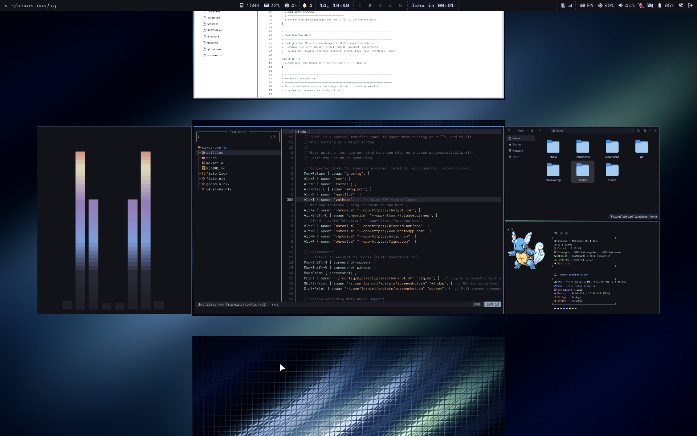
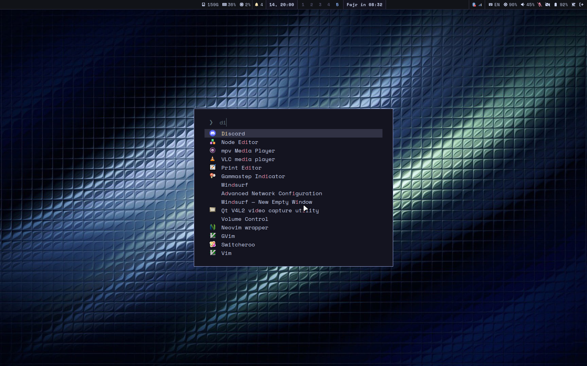
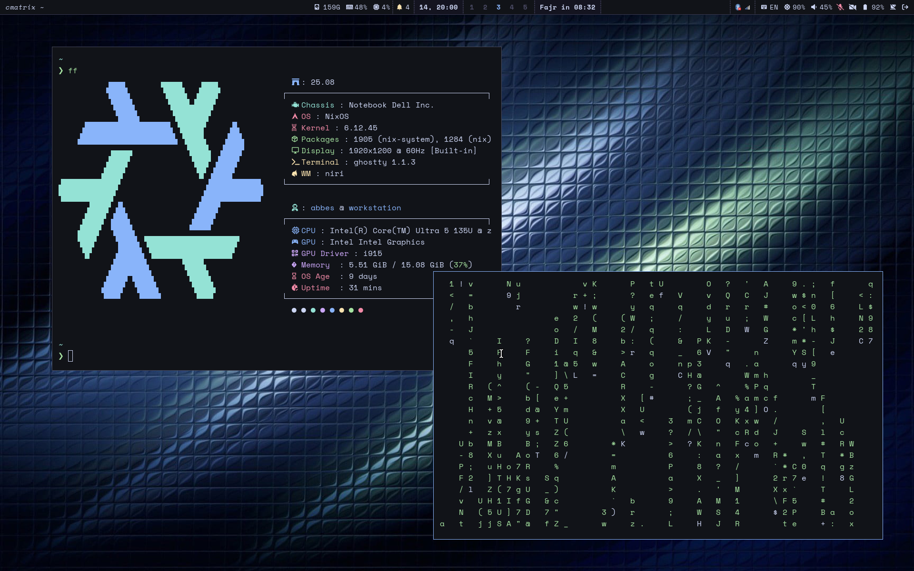

# NixOS Configuration

Personal NixOS configuration with reproducible system builds.

## Screenshots

### Desktop Overview

*Clean desktop with Niri compositor and Waybar*

### Application Launcher

*Fuzzel application launcher*

### Window Management

*Niri's advanced window management with floating windows*

## Setup

### 1. GitHub Authentication

Generate SSH key:

```bash
ssh-keygen -t ed25519 -C "your-email@example.com" -f ~/.ssh/github_rsa
cat ~/.ssh/github_rsa.pub
```

Test connection:

```bash
ssh -T git@github.com
```

Or use GitHub CLI:

```bash
gh auth login
```

### 2. Install Base Packages

Edit `/etc/nixos/configuration.nix` and add to systemPackages:

```nix
git gnumake vim
```

Apply changes:

```bash
sudo nixos-rebuild switch
```

### 3. Install Configuration

```bash
git clone https://github.com/abbesm0hamed/nixos-config
cd nixos-config
rm -rf hosts/workstation/hardware-configuration.nix
cp /etc/nixos/hardware-configuration.nix hosts/workstation/
make s
```

## Usage

- `make s` - Apply configuration
- `make build` - Build without switching
- `make update` - Update dependencies

## Structure

```
├── hosts/workstation/    # Host-specific config
├── modules/             # Custom modules
├── flake.nix           # Main configuration
└── Makefile            # Build commands
```
